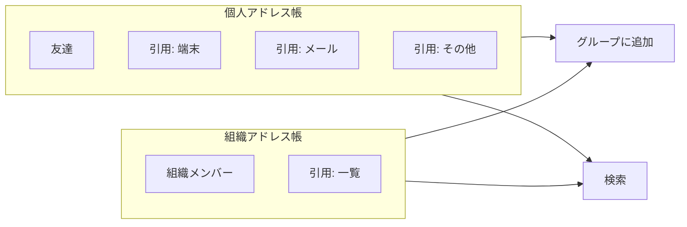

# アドレス帳 計画書

## 1. 目的とスコープ

- **アドレス帳**: 「グループに追加できる候補」「検索の対象」を一元的に管理するリスト。**個人**と**組織**の2種類を持つ。
- 現状の「友達一覧」「グループメンバー候補」「組織メンバー」「連絡先インポート」を**アドレス帳**という概念で再整理し、名前の統一・統合と「引用」機能の拡張を行う。

## 2. 現状の整理（マッピング）

| 現状の概念 | データ元 | アドレス帳での扱い |
|------------|----------|--------------------|
| 友達一覧 | `friendships` (status=accepted) | **個人アドレス帳**の1ソース。友達＝アドレス帳に載っている人とみなす |
| グループ追加時のメンバー候補 | `getChatPageData` の `allUsers`（最大100件）＋ `api/users.php` for_group_add（組織メンバー） | **個人アドレス帳**または**組織アドレス帳**から選択する形に変更 |
| 友達追加モーダル「メンバー」タブ | `getGroupMembersForFriends`（同一グループメンバー＋システム管理者） | **個人アドレス帳**の別ビュー（「同じグループの人」フィルタ）に統合可能 |
| 組織メンバー | `organization_members` | **組織アドレス帳**の実体。組織のアドレス帳＝その組織のメンバー＋引用で追加した外部連絡先（方針次第） |
| 連絡先タブ / 連絡先インポート | Contact Picker API、`contact_imports`、設定のCSV/vCard | **引用**の一種。「端末連絡先を引用」「メールアドレスを引用」としてアドレス帳に取り込む |

参照コード:

- 友達: [api/friends.php](../api/friends.php) (list, search), [database/migration_friends.sql](../database/migration_friends.sql) (`friendships`)
- グループ追加候補: [includes/chat/data.php](../includes/chat/data.php) (`allUsers` 222–235行), [api/users.php](../api/users.php) (for_group_add, scope=org)
- 連絡先: [api/friends.php](../api/friends.php) (check_contacts, import_contacts), [includes/chat/modals.php](../includes/chat/modals.php) 連絡先タブ, [settings.php](../settings.php) 連絡先インポート, [database/migration_friends.sql](../database/migration_friends.sql) (`contact_imports`)

## 3. アドレス帳の種類と役割

- **個人アドレス帳**
  - そのユーザーが「追加してよい」と扱う人の一覧。
  - グループ作成・メンバー追加時は「個人アドレス帳」から選択（組織に紐づくグループの場合は、組織アドレス帳も併用可能にするかは方針で決定）。
  - 検索（グローバル検索のユーザー候補）は、個人アドレス帳に載っている人を優先表示するなどの制御が可能。

- **組織アドレス帳**
  - 組織に属するメンバー（`organization_members`）を中核とする。
  - オプション: 「引用」で追加した連絡先（他組織の人・未登録のメール等）を組織アドレス帳に「招待候補」として持つかどうかは要件次第。
  - グループ追加時: 組織ルームを作るときは「組織アドレス帳」から選択。

## 4. 「引用」の定義とパターン

**引用**: 外部の連絡先ソースからアドレス帳に「取り込む」または「参照して候補にする」こと。

| 引用元 | 内容 | 想定実装 | 備考 |
|--------|------|----------|------|
| **携帯電話の連絡先** | 端末に登録された電話番号・名前 | Contact Picker API（既存）＋「アドレス帳に追加」 | 既存の友達追加「連絡先」タブをアドレス帳の引用UIに統合 |
| **メールのアドレス** | メールクライアントやメールアドレス一覧 | 手動入力（複数行ペースト）／OAuthでメール連絡先読み取り（将来） | 既存の「メールで検索」を引用の一種として位置づけ |
| **CSV / vCard** | 設定の「連絡先インポート」 | 既存の import を「個人アドレス帳への引用」として扱う | [settings.php](../settings.php) 2712行付近、[api/friends.php](../api/friends.php) import_contacts |
| **既存グループのメンバー** | あるグループのメンバー一覧 | 「このグループのメンバーを引用」で個人 or 組織アドレス帳に追加 | 新規UI・API |
| **他組織の公開ディレクトリ** | 他組織が公開するメンバー一覧（将来） | 組織間連携が許容される場合の拡張 | フェーズ2以降 |

引用レコードに持たせる情報の例:

- 誰のアドレス帳に紐づくか（user_id または organization_id）
- 引用元（source: `device_contact` / `email_paste` / `csv_import` / `vcard_import` / `group_members` 等）
- 連絡先の識別子（メール、電話番号の正規化値、または user_id にマッチした場合そのID）
- 表示名（引用元の名前）
- マッチした user_id（登録ユーザーと照合した場合）

既存の `contact_imports` は「個人・引用元・マッチ結果」をすでに持っているため、個人アドレス帳の「引用」テーブルとして拡張するか、`address_book_entries` のような新テーブルに寄せて `contact_imports` を移行するかを設計で決定する。

## 5. データモデル案（概要）

- **address_books**
  - `id`, `owner_type` (user / organization), `owner_id`, `name`（任意）, `created_at`, `updated_at`
  - 個人: owner_type=user, owner_id=user_id。1ユーザー1アドレス帳でよい場合は `owner_type` だけで省略可。
  - 組織: owner_type=organization, owner_id=organization_id。

- **address_book_entries**
  - `id`, `address_book_id`, `user_id` (NULL可), `email`, `phone`, `display_name`, `source` (manual / device_contact / email_import / csv_import / vcard_import / group_reference 等), `reference_id` (引用元ID、例: contact_imports.id), `created_at`
  - 登録ユーザーにマッチしている場合は `user_id` をセット。未登録の場合は `email` または `phone` と `display_name` のみ。

既存テーブルとの関係:

- **個人**: `friendships` の accepted は「アドレス帳に載っている」と等価にする場合、`address_book_entries` に friend_id を自動で持たせるか、アドレス帳取得時に friendships を UNION するかで表現。
- **組織**: `organization_members` が組織アドレス帳の実体。引用で追加する外部連絡先だけ `address_book_entries` に持つか、組織は「メンバーのみ」に限定するかは要件次第。
- **contact_imports**: 個人の「引用」としてアドレス帳と紐づけ、一覧表示・検索時に統合する。

## 6. UI・フロー案

- **アドレス帳の参照場所**
  - グループ作成・メンバー追加モーダル: 現在の「メンバーを選択」を「アドレス帳から選択」に変更。個人／組織の切り替え（組織ルームなら組織アドレス帳も表示）。
  - 検索: グローバル検索のユーザー結果を「個人アドレス帳」ベースでフィルタまたはソート（任意）。
  - 設定または専用ページ: 「アドレス帳」一覧・編集・引用の実行（端末連絡先・メール・CSV・グループからの引用）。

- **引用のUI**
  - 個人アドレス帳画面に「引用」ボタンまたはタブを設ける。
    - **端末連絡先を引用**: 既存の Contact Picker → 選択した連絡先をアドレス帳エントリとして追加（既存 check_contacts の結果を保存する形）。
    - **メールアドレスを引用**: テキストエリアにメールを複数行でペースト → パースしてエントリ追加。既存の「メールで検索」フローと統合。
    - **CSV/vCard**: 既存の設定の連絡先インポートを「アドレス帳への引用」として実行し、結果をアドレス帳に表示。
    - **グループから引用**: 自分がメンバーのグループを選択 → そのメンバー一覧をアドレス帳に追加（重複はスキップ）。

- **名前の変更**
  - 「友達」→ 説明文では「個人アドレス帳の一部」とし、UIラベルは「友達」のままでも可。または「アドレス帳」を前面に出し、「友達」はアドレス帳の「承認済み」フィルタとみなす。
  - 「メンバーを選択」「グループのメンバー」→ 「アドレス帳から選択」に変更。
  - 設定の「連絡先インポート」→ 「アドレス帳へ引用（CSV/vCard）」などに文言統一。

## 7. API 方針

- **アドレス帳一覧取得**: `GET/POST api/address_book.php?action=list`（owner_type, owner_id で個人 or 組織）。返却は `address_book_entries` ＋ 友達／組織メンバーを統合した形。
- **検索**: `api/address_book.php?action=search` または既存 `api/users.php` のスコープを「アドレス帳内」に限定するオプションを追加。
- **グループ追加時の候補取得**: 既存の `api/users.php` for_group_add を「アドレス帳から取得」に差し替えるか、`api/address_book.php` から取得してから users とマージするかで検討。
- **引用の実行**: `api/address_book.php?action=import_from_device` / `import_from_email` / `import_from_group` 等。既存の `api/friends.php` check_contacts, import_contacts はアドレス帳の「引用」として呼び出す形に寄せる。

## 8. フェーズ分け（実装順の目安）

| フェーズ | 内容 |
|----------|------|
| 1 | 計画書の確定、データモデル（address_books / address_book_entries）とマイグレーション、既存 contact_imports との関係定義 |
| 2 | 個人アドレス帳: 友達＋引用の統合表示API、グループ追加モーダルで「アドレス帳から選択」に切り替え |
| 3 | 引用UIの整備: 端末連絡先・メール引用・CSV/vCard を「アドレス帳への引用」として実行し、一覧に反映 |
| 4 | 組織アドレス帳: 組織メンバーをアドレス帳として取得、組織ルーム作成時の「組織アドレス帳から選択」 |
| 5 | グループからの引用、「検索でアドレス帳を優先」などの拡張 |

## 9. 関連ドキュメント

- 本計画書: **DOCS/ADDRESS_BOOK_PLAN.md**
- アドレス帳導入後に追記する前提: [SEARCH_POLICY.md](SEARCH_POLICY.md), [SEARCH_ARCHITECTURE.md](SEARCH_ARCHITECTURE.md) に「グループ追加・検索はアドレス帳を参照する」旨を記載する。

## 10. 注意点・検討事項

- **プライバシー**: アドレス帳に「誰を載せるか」は本人または組織管理者の意図に基づく。引用で取り込んだメール・電話番号は、登録ユーザーとの照合結果のみ保存するなど、最小限の保持にするかは要検討。
- **組織アドレス帳の範囲**: 組織メンバーのみにするか、引用で「招待候補」を組織アドレス帳に持つかで、招待フローが変わる。
- **既存の友達申請**: 友達＝個人アドレス帳のエントリとみなす場合、申請承認時にアドレス帳エントリを自動作成するか、アドレス帳は「引用」のみで友達は別管理にするかは方針で決定する。
