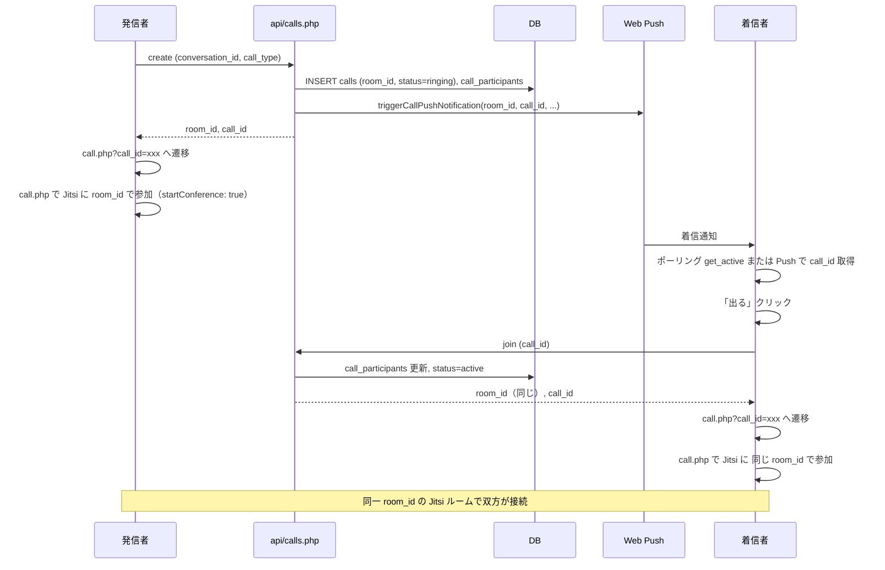

# ビデオ通話「繋がらない・重複通知・表示」問題の分析と修正計画

## 1. 目的と優先順位

- **最優先**: リアルタイムで電話が**確実に繋がる**こと。繋がらなければ意味がない。
- **厳守**: 相手が通知を受けて「出る」を押したら、**自分の映像が相手に届き、相手の映像が自分に届く**同線を保証する。
- **副次**: 切ったあと相手に何度も通話連絡が行かないようにする（leave 必呼び出し）。画面の大きさ変更・相手パネルの移動を可能にする。

---

## 2. 接続を「様々な角度から」検証する項目

**通信が繋がらない主因**: meet.jit.si（公開サーバー）では、iframe 経由の configOverwrite.startConference が**尊重されず**、会議が「モデレーター待ち」のまま開始されないことがある。アプリ側では発信者に startConference: true を送っているが、サーバー側で効かないため、確実に繋ぐには**自前 Jitsi を構築し、サーバー側 config で会議即開始（everyoneIsModerator 等）を設定すること**が必須。詳しくは [PHONE_VIDEO_CALL_PLAN.md](DOCS/PHONE_VIDEO_CALL_PLAN.md) 8.2-B・8.6 を参照。

### 2.1 同線の一意性（同じルームに必ず入る）

| 検証項目 | 現状 | リスクと対策 |
|----------|------|----------------|
| **room_id の一致** | create で 1 回生成し DB に保存。発信者は create のレスポンスの room_id で Jitsi に参加。着信者は join で call_id を送り、API が **同じ call の room_id** を返す。 | 一致している。join は `c.room_id` を返すため、双方とも同じ room_id で Jitsi に参加する。 |
| **Jitsi ドメイン・URL** | 双方とも `config` の JITSI_BASE_URL / JITSI_DOMAIN を参照。chat は同一ページなので同じ値。 | 一致している。自前 Jitsi 導入時も app.local で一元設定すればよい。 |
| **roomName の渡し方** | initJitsiMeet(roomName, ...) に room_id をそのまま渡し、JitsiMeetExternalAPI の options.roomName に設定。 | 正しい。大文字小文字・前後の空白が混入しないよう、API から受け取った room_id をそのまま渡すこと。 |

**結論**: 同線（同じ Jitsi ルーム）になる条件は満たしている。繋がらない原因は「会議が開始されない」「一方が leave せずに抜ける」など別要因。

### 2.2 会議開始（モデレーター待ちで止まらない）

| 検証項目 | 現状 | リスクと対策 |
|----------|------|----------------|
| **発信者側** | startConference: true（isInitiator 時のみ）を configOverwrite に設定済み。 | meet.jit.si では効かない場合がある。自前 Jitsi では config.js で `startConference` や会議即開始を保証する。 |
| **着信者側** | isInitiator: false のため startConference は送らない。発信者が既に会議を開始している前提。 | 発信者が先に Jitsi に参加し、会議が start してから着信者が join する順序が理想。 |
| **タイミング** | 発信者が「通話終了」で画面を閉じても leave を呼んでおらず、call が ringing のまま。着信者が後から join すると、発信者は既にいない。 | **必須**: 発信者が終了/閉じる際は必ず leave を呼び、calls.status を ended にする。そうすれば着信者は get_active で「その通話はもうない」と分かり、無駄な着信表示が続かない。 |

**結論**: 「繋がらない」の一因は、発信者が leave せずに抜けることで call が残り、相手側の状態が不整合になること。加えて、meet.jit.si では startConference が効かず会議が開始されない場合がある。自前 Jitsi で会議即開始を設定すれば確実性が増す。

### 2.3 通知→「出る」→同線までの経路

**確認すべき点**:
- 着信者が「出る」を押したとき、**join に渡す call_id** は get_active または Push の data.call_id と一致しているか。→ 現状、get_active の call.id と join の call_id は一致。Push の data.call_id も同じ。
- join のレスポンスの **room_id** を、call.php が DB から取得した room_id で Jitsi に渡しているか。→ call.php は call_id で room_id を取得し、Jitsi の roomName に渡す。同線になる。

**実施済みの点**:
- 発信者は create 後に **call.php?call_id=xxx へ遷移**。call.php で leave を endCall および beforeunload で呼ぶ（callId を PHP で渡している）。
- 着信者は join 後に **call.php?call_id=xxx へ遷移**。同じく call.php で leave を呼ぶ。

### 2.4 映像が届く条件（Jitsi 側）

- 双方が **同じ roomName（room_id）** で Jitsi に参加している。
- 会議が **開始済み**（モデレーターがいる、または everyoneIsModerator で即開始）。
- **disableSelfView: true** により、自分の顔が Jitsi のメイン領域に重複表示されない（自分パネルは自前のローカルカメラのみ）。
- **filmstrip.disabled: true** でフィルムストリップを出さず、相手はメイン領域に表示される。

自前 Jitsi では、config.js で `everyoneIsModerator` や会議即開始を設定し、meet.jit.si 依存の「モデレーター待ち」をなくす。

### 2.6 通話UIの統合（call.php のみ）

**通話は call.php に統合済み**（通話機能統合計画書）。チャットは「発信」「着信応答」の入口のみで、Jitsi は **call.php でだけ** 動作する。チャット内に通話ビデオウィンドウ・コントロールバーは出さない。

| 入口 | URL・ファイル | 案内の場所 |
|------|----------------|------------|
| **通話画面（唯一）** | `call.php?call_id=xxx`。発信時は create 後に遷移、着信時は join 後に遷移。 | `call.php` の `.video-area` 内、`#jitsiContainer` 直後に `
接続しない場合は、画面内の「私はホストです」を押してください。
`。スタイルは `call.php` の `<style>` 内。 |
| **チャット** | `chat.php`。通話メニュー（ビデオ/音声）・着信モーダル（拒否/出る）のみ。「出る」で call.php へ遷移。 | 案内は表示しない（通話は call.php で実施）。 |

- **meet.jit.si 暫定案内** は **call.php のみ** に表示。確実に繋ぐには自前 Jitsi で会議即開始設定を実施すること（本ドキュメント 2.1〜2.2 および [PHONE_VIDEO_CALL_PLAN.md](DOCS/PHONE_VIDEO_CALL_PLAN.md) 8.2-B・8.6 参照）。

### 2.7 繋がらない原因の一覧と対策

| 原因 | 対策 |
|------|------|
| 発信者が leave せずに抜け、call が ringing のまま残る | endCall および beforeunload で leave を必ず呼ぶ。currentCallId を保持して leave に渡す。 |
| 会議が「モデレーター待ち」で開始されない | 発信者のみ startConference: true を送る（済）。自前 Jitsi で everyoneIsModerator 等を設定。 |
| 発信者が先にタブを閉じ、着信者が join したときには誰もいない | leave を呼べば call は ended になり、着信者は get_active で当該通話を取得しなくなる。新たに発信し直せばよい。 |
| 相手パネルで Jitsi iframe が mousedown を奪い、パネルが動かせない | 相手パネル用のドラッグハンドル（ラベル「相手」または専用バー）を設け、その要素でのみドラッグを開始する。 |
| 画面サイズが固定で変更しづらい | 各パネルにリサイズハンドルを付け、ドラッグで大きさを変更可能にする。 |

---

## 3. 厳命事項（実装で必ず守ること）

1. **繋がらなかった場合に、自分が画面を閉じているなら相手に再度着信を出さない**  
   - 発信者・着信者のどちらでも「通話終了」またはタブ閉じ／リロード時に、**必ず api/calls.php?action=leave を呼ぶ**。  
   - leave を呼ぶために、**currentCallId** を create/join のレスポンスで設定し、endCall および beforeunload で使用する。

2. **相手が通知で「出る」を押したら確実に同線にする**  
   - join が返す **room_id** をそのまま Jitsi の roomName に渡す（済）。  
   - 発信者は **leave を呼ぶまで** call を終了させない（勝手に抜けない）。  
   - 自前 Jitsi を運用する場合は、会議が即開始される設定（everyoneIsModerator 等）を入れる。

3. **重複通知を防ぐ**  
   - leave が実行されると calls.status が ended になり、get_active に現れなくなる。  
   - 着信モーダルを閉じたあと、同じ call が再度表示されないようにする。

4. **着信は画面中央のモーダル（拒否・出る）のみとする**  
   - 通話着信時は **Web Push のトースト（OS通知）を一切出さない**。着信表示は **画面中央のモーダル（拒否・出る）のみ**とする（チャットの get_active ポーリングで表示）。  
   - 実装: [sw.js](sw.js) の push ハンドラで、`data.type === 'call_incoming'` のときは常に `showNotification` を呼ばない。

---

## 4. 実装タスク一覧

### 4.1 接続の確実性（最優先）

**通話は call.php に統合済み**。leave の呼び出しは **call.php** で実施（callId を PHP で渡し、endCall および beforeunload で callLeaveApi を実行）。チャット側は create 後に call.php へ遷移、join 後に call.php へ遷移するのみ。

| # | タスク | ファイル | 内容 |
|---|--------|----------|------|
| 1 | 通話 ID の渡し方 | call.php | call_id を GET で受け取り、leave API に渡す。callId を PHP で出力し、callLeaveApi() で使用。 |
| 2 | 着信で「出る」時の遷移 | includes/chat/scripts.php | join のレスポンスで call_id を取得し、location.href = 'call.php?call_id=' + data.call_id で遷移。 |
| 3 | endCall で leave 必呼び出し | call.php | endCall() 内で callLeaveApi() を呼ぶ。callLeaveApi は leaveSent で二重送信防止。 |
| 4 | beforeunload で leave 送信 | call.php | window.onbeforeunload で api が存在すれば callLeaveApi() を呼ぶ。 |
| 5 | 発信時の遷移 | includes/chat/scripts.php | startCall で create 後に location.href = 'call.php?call_id=' + data.call_id で遷移。 |

### 4.2 相手パネルの移動

| # | タスク | ファイル | 内容 |
|---|--------|----------|------|
| 6 | 相手パネル用ドラッグハンドル | includes/chat/scripts.php | 相手パネル（.call-panel-remote）に、ラベルとは別の「ドラッグで移動」用のハンドル（例: 上部バーやラベル右のアイコン）を追加。initDraggableCallPanels で、リモートパネルはハンドル要素の mousedown/touchstart でのみドラッグを開始するよう変更。 |
| 7 | ハンドルのスタイル | assets/css/chat-main.css | 相手パネルのドラッグハンドルを z-index で iframe より手前にし、cursor: move で分かりやすくする。 |

### 4.3 画面サイズの自由な変更

| # | タスク | ファイル | 内容 |
|---|--------|----------|------|
| 8 | パネルリサイズ | includes/chat/scripts.php | 各 .call-panel-draggable にリサイズハンドル（四隅または右端・下端）を追加。ドラッグで panel の width/height を変更。最小・最大サイズを指定し、わかりやすく操作可能にする。 |
| 9 | リサイズ用スタイル | assets/css/chat-main.css | リサイズハンドルの見た目（つまみ・マウス形状）を定義。 |

### 4.4 ドキュメント・自前 Jitsi

| # | タスク | ファイル | 内容 |
|---|--------|----------|------|
| 10 | 計画書の追記 | DOCS/PHONE_VIDEO_CALL_PLAN.md | フェーズ2 の注記に「終了時は必ず leave を呼び相手側の着信を止める」「会議が確実に開始されるよう自前 Jitsi では everyoneIsModerator 等を推奨」を追記。 |
| 11 | 依存関係の更新 | includes/chat/DEPENDENCIES.md | 通話終了時の leave 呼び出しと本計画書への参照を追記。 |

---

## 5. 接続フローの再確認（実装後のチェックリスト）

- [ ] 発信者が create すると call_id と room_id が返り、currentCallId がセットされる。
- [ ] 発信者が showCallUIAndStartJitsi(room_id, ..., true, call_id) で Jitsi に参加する。
- [ ] 着信者が get_active または Push で call を取得し、「出る」で join(call_id) を呼ぶ。
- [ ] join のレスポンスの room_id が発信時と同じである。
- [ ] 着信者が showCallUIAndStartJitsi(room_id, ..., false, call_id) で同じ room_id の Jitsi に参加する。
- [ ] 発信者が「通話終了」またはタブを閉じると、leave が呼ばれ、calls.status が ended になる。
- [ ] 着信者の次の get_active で当該通話が含まれず、着信モーダルが再表示されない。
- [ ] 相手パネルはドラッグハンドルで移動できる。
- [ ] 各パネルはリサイズハンドルで大きさを変更できる。

---

## 6. 自前 Jitsi での推奨設定（繋がりを確実にするため）

- **config.js**（または equivalent）で会議を即開始する設定を行う。例:
  - `startConference: true` の扱いをサーバー側で保証する。
  - または `everyoneIsModerator: true` などで、参加者が誰でも会議を開始できるようにする。
- これにより「モデレーターが到着していません」で止まらず、相手が「出る」を押した時点で同一ルームに確実に入り、映像が届く。

---

以上を実装し、接続の確実性を最優先に、重複通知の防止と UI（相手パネル移動・リサイズ）を整える。
