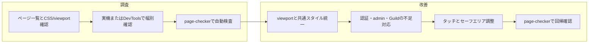

# Social9 全デバイス表示 調査・改善計画書

Social9 を iPhone・Android・iPad・PC などあらゆるデバイスで問題なく閲覧できるよう、調査計画と改善計画をまとめたドキュメントです。

## 関連ドキュメント

- **調査結果（Phase A 一覧）**: [DEVICE_VIEW_AUDIT.md](DEVICE_VIEW_AUDIT.md) — ページ別 viewport / CSS / 改善チェックリスト
- **既存モバイル関連**: [MOBILE_CHAT_HEADER_GROUP_NAME.md](MOBILE_CHAT_HEADER_GROUP_NAME.md)、[MOBILE_FILE_UPLOAD_FIX.md](MOBILE_FILE_UPLOAD_FIX.md)

---

## 1. 現状の整理

### 1.1 デバイス・ブレークポイント

- **判定**: PHP は `config/app.php` の `is_mobile_request()`（User-Agent）で携帯判定。JS は `window.innerWidth <= 768` と UA の併用（includes/chat/scripts.php 等）。
- **CSS ブレークポイント**: ほぼ **768px**（スマホ/タブレット縦）と **480px**（小型スマホ）の2段階。**1024px** は admin.css の一部のみ。
- **iPad**: 768px 以下で「モバイル」扱いのため、iPad 縦（768x1024）はモバイル用レイアウトになる。既存 admin/page-checker.php のビューポートは iPhone SE 375x667、iPhone 14 390x844、iPad 768x1024、ノートPC 1280x800、デスクトップ 1920x1080 を想定済み。

### 1.2 ページ別モバイル対応の有無

| 分類 | ページ | viewport | モバイル用CSS/JS | 備考 |
|------|--------|----------|------------------|------|
| メイン | chat.php | あり | mobile.css + chat-mobile.css + chat-mobile.js | 最も手が入っている |
| サブ | settings, tasks, notifications, design | あり | mobile.css + pages-mobile.css | 共通ページ用 |
| 認証・入口 | index, register, forgot_password, reset_password, verify_email, accept_org_invite, invite, join_group, call | あり | common.css のみ／インラインのみのページあり | フォーム・ボタンのタップ領域要確認 |
| 管理 | admin/* | あり | common.css または admin.css | admin.css に @media 768/1024 あり |
| Guild | Guild/* | あり | common + layout + 各ページCSS | 各CSS に @media あり |
| その他 | 404, admin.php, memos.php（リダイレクト） | あり | 各種 | 軽いページ |

### 1.3 既存アセット

- **assets/css/mobile.css**: 768px/480px で共通モバイル（ヘッダー・パネル・モーダル・タッチターゲット等）
- **assets/css/pages-mobile.css**: 設定・タスク・通知・デザイン用（FAB・タブ・カード等）
- **assets/css/chat-mobile.css**: チャット専用（ストリップ・グループ名・メッセージ領域等）
- **assets/js/chat-mobile.js**: ストリップスクロール・パネル開閉・会話クリック委譲

---

## 2. 調査計画

### 2.1 対象ページ一覧

- **ルート**: chat, settings, tasks, notifications, design, call, index, register, forgot_password, reset_password, verify_email, accept_org_invite, invite, join_group, admin, 404, memos（リダイレクト）
- **admin**: index, users, members, groups, settings, security, monitor, attackers, logs, reports, backup, providers, wishes, improvement_reports, page-checker 等
- **Guild**: home, request, request-new, my-requests, requests, calendar, setup 等（templates/header.php で共通レイアウト）

### 2.2 調査項目（ページごと）

1. viewport の有無と内容
2. モバイル用CSS（mobile.css / pages-mobile.css / chat-mobile.css）の読み込み有無
3. 固定幅・はみ出し（overflow）
4. タッチ・操作性（最小 44px、tap-highlight、touch-action）
5. フォーム（input/textarea/select の font-size 16px 以上）
6. セーフエリア（env(safe-area-inset-*)）
7. iPad 等 768～1024px の表示
8. モーダル・ドロップダウンの小画面での挙動
9. admin/page-checker.php によるビューポート×テーマ×ページの検査

### 2.3 調査の進め方

- **Phase A**: 全エントリポイントの「viewport / 読み込みCSS」一覧 → [DEVICE_VIEW_AUDIT.md](DEVICE_VIEW_AUDIT.md) に実施済み。
- **Phase B**: 実機または DevTools で 375px / 390px / 768px / 1024px 幅で主要ページを確認し、不具合をリスト化。
- **Phase C**: page-checker で視覚チェック・コンソールエラーを実行し、デバイス×ページごとの問題を記録。

---

## 3. 改善計画

### 3.1 方針

- **ブレークポイント**: 現状の 768px / 480px を維持。必要に応じて 1024px を追加。
- **対象**: すべての「ユーザーがブラウザで開くページ」で、(1) viewport 設定、(2) 横はみ出しの解消、(3) タップ可能なコントロールのサイズ確保 を満たす。
- **既存の強み**: チャット・設定・タスク・通知・デザインはすでに mobile.css + pages-mobile.css で対応済み。

### 3.2 改善タスク（優先度順）と実施状況

| # | タスク | 実施状況 |
|---|--------|----------|
| 1 | 全ページ viewport 統一 | 実施済み（全ページに viewport あり。必要なら maximum-scale を限定的に適用） |
| 2 | 認証・入口ページのモバイル確認と mobile.css または @media 追加 | 実施済み（下記のとおり） |
| 3 | 管理画面の小画面対応確認 | 実施済み（admin.css の @media で対応済みのため記載のみ） |
| 4 | Guild のモバイル確認 | 実施済み（layout.css 等に @media ありのため記載のみ） |
| 5 | タブレット 768～1024px の扱い | 現状維持（768 以下をモバイルとして問題なければ変更なし） |
| 6 | タッチ・フォーム・セーフエリア | 実施済み（common.css / pages-mobile.css に追加） |
| 7 | モーダル・ドロップダウン小画面確認 | 既存 scripts.php 等の位置補正で対応。新規問題は個別対応 |
| 8 | page-checker の定期利用 | 本ドキュメントで運用として明記 |

### 3.3 成果物・DEPENDENCIES

- **調査結果**: [DEVICE_VIEW_AUDIT.md](DEVICE_VIEW_AUDIT.md)
- **本計画書**: 本ファイル（DEVICE_VIEW_SURVEY_AND_IMPROVEMENT_PLAN.md）
- 新規に admin-mobile.css や Guild 用モバイル CSS を追加した場合は、assets/css/DEPENDENCIES.md および admin/DEPENDENCIES.md 等を更新する。

---

## 4. フロー概要

---

## 5. 次のアクション（継続作業用）

1. Phase B・C で実機または DevTools / page-checker を実行し、[DEVICE_VIEW_AUDIT.md](DEVICE_VIEW_AUDIT.md) の「Phase B/C メモ」に不具合を追記する。
2. 新規ページ追加時は、本計画の「調査項目」に沿って viewport とモバイル用CSS の有無を確認し、必要なら AUDIT に追加する。
3. デバイス×ページの表示変更を行った際は、可能な範囲で page-checker で回帰確認する。
